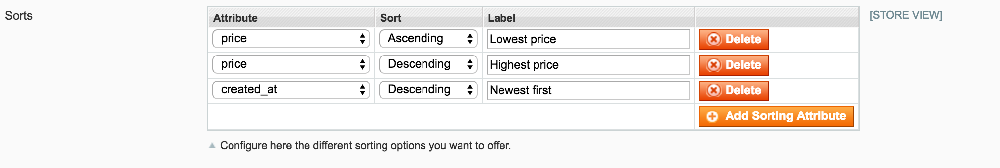
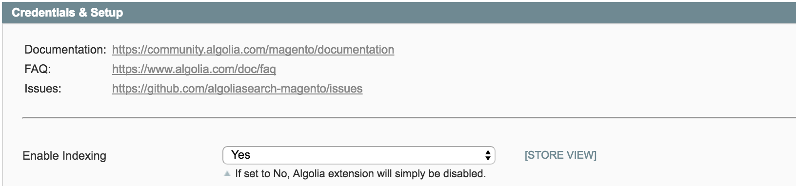
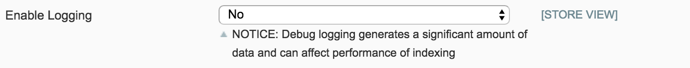

## How many records does the Magento extension create?

The Magento extensions creates several indices.

To be able to have very fast results Algolia precomputes part of the order of the results at indexing time. This means that you cannot have multiple sorts for a single index. To handle multiple sorts, we need to create 1 Algolia index for each sort.

In Magento, this results in creating by default:

- 1 index per store
- 1 index per store per additional sort order (by price, by date, ...)

Which means that for a Magento instance with:

- 2 stores (2 languages for example)
- 100 products
- 2 sorts on "price" (asc, desc)
- 2 sorts on "date" (asc, desc)

You'll have 100 * 2 + 100 * 4 * 2 = 1000 Algolia records.

If you enable the customer group feature it creates:

- 1 index per store
- 1 index per price sort per group per store => This is to be able to have the correct sort on price no matter what the user group
- 1 index per non-price sort per store

Which means that for a Magento instance with:

- 2 stores (2 languages for example)
- 100 products
- 5 customer groups
- 2 sorts on "price" (asc, desc)
- 2 sorts on "date" (asc, desc)

You'll have 100 * 2 + 100 * 2 * 5 * 2 + 100 * 2 * 2 = 2600 Algolia records.

You can reduce the number of records by removing some sorts. This can be configured in the extension administration panel. See the screenshot below:

<figure>
    
    <figcaption>Sorting configuration</figcaption>
</figure>

## After reindexing my search doesn't work and I see _"Cannot read property 'autocomplete' of undefinded"_ error in browser's console

The error means that extension's templates were not rendered.

Templates are rendered to `before_body_end` block, please make sure that your theme renders this block.

If your theme renders the block, make sure you have allowed symlinks in the Magento's configuration. You can enable it in **System > Configuration > Advanced > Developer** section of Magento configuration.

## Why Magento shows "404 error page not found." in configuration?

Logout and login from your Magento administration panel should fix the issue.

## Can I disable Algolia on some store?

Yes you just need to disable indexing for the store where you do not need Algolia. Navigate to **System > Configuration > Algolia Search**, in upper left corner switch to store you want to disable from indexing. Then you can just disable indexing in the configuration. See the screenshot:

<figure>
    
    <figcaption>Enable indexing setting</figcaption>
</figure>

## I hit "Reindex" button, but there are still no products in Algolia indices

In case you have indexing queue enabled, the reindex button will "only" insert indexing jobs to queue database table and not really send them to Algolia. Please make sure you have set queue processing correctly and you have set reasonable number of products to be processed in one job. If you set the number od processed products too high the processing script may run out of memory and no products will be indexed.
More information about indexing queue can be found in [documentation](/magento/doc/m1/indexing-queue/).

## Some of my products do not come up during searching

At first please check if those products are indexed correctly in Algolia. You can go to your [Algolia explorer](https://www.algolia.com/explorer) select your default products index and search for products which are missing on your website.
If you can find the missing products in Algolia, check if the products have set correct visibility. If products should be visible only in "Catalog", they will not come up when searching, but only on instant search page in category.

If you cannot find the products in Algolia indices, the products are not indexed in Algolia. The extension indexes only visible, enabled and "on-stock" products (only in case you have set you want to index only "on-stock" products). More information about indexing you can find in [documentation](/magento/doc/m1/indexing/).
So please check if the products meet all the requirements for indexing. If they do you should hit "Reindex" button again and check again the Algolia index.

If the issues persist you can go Algolia configuration in Magento, turn on logging and investigate log files. There you should be able to find more information about what is going on while re-indexing. More information about troubleshooting and debugging you can find in [documentation](/magento/doc/m1/logging-and-debugging/).

## I cannot find my products by SKU

Please, make sure you are using the newest version of the extension. And make sure you set SKU as searchable attribute to index in Algolia's extension configuration in Magento backend.

## I have deleted some products, why are they still appearing in Algolia indices even after full reindex?

Please, make sure you are using the latest version of the extension. It happens when you update / delete your products directly in database and do not trigger standard Magento hooks. The full reindex then had problem with recognizing deleted products and removing them from Algolia.

This issue was resolved in version 1.6.0. Instruction how to upgrade can be found in [documentation](/magento/doc/m1/upgrade/).

## I can see a spike in amount of indexing operations (like 10x the total number of records). What is the reason?

The most probable reason is automatic import of products and it’s testing.
Your store might use an automatic import extension / script to update the catalog either directly from their providers or your ERP system. It can automatically import new products, delete old products, update prices, stock availabilities and basically all information about products.

This brings 2 issues to the extension:

- The import “saves” all products during it’s import causing Algolia extension to propagate all those “saves” to Algolia. It basically means running a full reindex when the import runs. 
It gets more complicated when the import doesn’t do 1 “save” per product, but multiple “saves”. It updates stock and “save”, updates price and “save”. The extensions listens only on the “save” and each “save” is propagated to Algolia costing 1 indexing operation.
- Some imports update data directly in database bypassing the “save” mechanism. So the Algolia extension is not aware of those changes (no “save” event propagated by Magento) and therefore it doesn’t reflect the changes and customer needs to manually run a full reindex after each import.

## Why are images not showing up?

Since Algolia is displaying results without going through the backend of magento, at indexing time we need to generate a link for the url. What magento give you when you are asking for this url is the url of the cached and resized image that you need to display.

On some occasions, users of our extension have encountered an issue where the cache for the images would not get automatically generated.

First thing you need to check is that you have a recent enough version of the extension. If you are using a version lower than 1.5.x, the first thing you need to do is update to the latest version.

There is two main issues that you can have with images are the following:

**If images are there and then go away:**

- **Why:**
It usually means that the image cache has been dropped, this usually something triggered manually in System > Cache management or via cli. Clearing the image cache will cause indexed link to be invalid because it doesn't exist anymore. When triggering a full reindex the image cache will be created again.

- **How to fix it:**
Avoid clearing the image cache, and in case you do, launch a full reindex just after.

**If images are not generating from the beginning:**

- **Why:**
In almost all cases it's due to memory issue or directory permissions.

- **How to fix it:**
Enable logging in System > Configuration > Algolia Search > Credentials and setup. After enabling the option, the extension will generate an algolia.log file in the /path/to/magento/var/log/ folder. After a full reindexing if you have some thumbnails issue you should see the issue/error in this file.

<figure>
    
    <figcaption>Logging configuration</figcaption>
</figure>

If that still doesn't work, you can also try:

- Checking permissions of the `/media` directory (it should be equal to `770 / 660`)
- Checking magento and apache/nginx logs, to check if there is an error message

## Can I integrate Algolia to my search page template?

The realtime search experience implemented by the extension is done using JavaScript in your end-users browsers and therefore cannot have access to the templates of your original theme (which is rendered with PHP from your backend). Instead, it creates a search page with a default theme that you may need to adapt to fit your UI needs.

But you can still customize the design of the instant search results page & the auto-complete menu. See [Customization section](/magento/doc/m1/customize-autocomplete/) in documentation.

## How instant search page works?

Instant search page is powered by JavaScript library [instantsearch.js](https://community.algolia.com/instantsearch.js/). This means that all the search is handled in your customer's web browser and nothing is going through Magento itself. The instant search fetches results directly from Algolia's API and renders them into the page. That said, instant search do not fetch the results from Magento engine and nothing is processed on your Magento server. This is one of the reasons why the searching in your catalog can be that fast and convenient.

But on the other hand it brings two inconveniences:

- **Templates:**
When the whole page is rendered in your client's web browser it cannot respect your Magento store's custom templates. Templates for instant search page must be customized in the extension's template file. For more information about customizing see [Customization section](/magento/doc/m1/customize-instantsearch/) in the documentation.
- **SEO:**
The extension supports only backend search for regular search page and these results can be indexed by search engines like Google, Bing, etc... But because of the frontend implementation instant search page results on category page cannot be indexed. But there is a workaround. Search parameters of the instant search page are pushed into page's URL. So it is possible to implement backend search base on the URL parameters so the instant search pages can be indexed. But the extension itself do not support this feature out of the box for now.

## Can I have different ordering of products on category pages with instant search? (e.g. with Visual Merchandiser)

Yes, this is definitely doable, but you have to be aware that you'll need to create more records in Algolia indices.
Algolia is designed for searching and for providing the best relevancy on search queries. With this being said there are some limitations regarding sorting the results according specific attributes.

First, you need to create a custom attribute with Virtual Merchandiser position which reflects the product's ranking with it's category. And push it to Algolia within products' records.
In case you have each product in only one category you can push to Algolia this attribute and then you can just set this attribute as the very first attribute for custom ranking and you are done.

If you have product in multiple categories and within each category it has a different ranking it becomes a bit tricky.
This use-case can be handled only by replica indices when you have one index per category and in each of these indices you have a different ranking strategy.
To achieve that you need to create a custom attribute with Virtual Merchandiser position for each category. Then you should create as many sort / replica indices as many VM custom attributes you have.
Next you will have to update your JavaScript code to target the correct index for each browsed category.

It’s definitely not optimal solution as you would have huge amount of records in Algolia and as well it’s not good for Algolia’s performance. But this is the only way how to achieve that.

But you can always limit a scope of Visual Merchandiser usage and use it only for your main categories or use the same sorting strategy across all your categories.

## After installing the Magento 2 extension I'm getting "Fatal error: Class 'AlgoliaSearch\Version' not found in ... /AlgoliaHelper.php on line ..."

This means you didn't install the extension in a correct way. There are two supported ways how to install the extension:

- via Composer
- via Component Manager

Both ways how to install the extension are described in [the documentation](/magento/doc/m2/getting-started/#install-the-extension).
 Please, reinstall the extension.

## The indexed URLs from my Magento 2 store are wrong, there is additional **magento/** in the middle of indexed URLs

Navigate to **Stores > Configuration > General > Web > Search Engine Optimization** and there set the field **Use Web Server Rewrites** to **Yes**. Then please reindex your catalog.

## In Magento2, the indexed image URLs have /pub/ at the beginning

This happens when your server is set use the `/pub/` directory as your root directory. This is
usually considered a good practice but their can be some drawbacks. When Algolia extension generates
URLs for your images, there is no way to know if you use the root Magento folder or the pub folder as
your root directory.

The best way is to [set your server](https://gist.github.com/julienbourdeau/ad4fadd9bbf9f99c46f8f8e28fb14ffc) to ignore this `/pub/` in the URLs.

There is also an option in the extension which will fix this without any server configuration.
Navigate to **Stores > Configuration > Advanced > Remove /pub/ from image URLs** and set the field to **Yes**. Then please reindex your catalog.

## My Magento generates a lot of delete operations, how can I prevent that?

The solution is to enable [the indexing queue](/magento/doc/m1/indexing-queue/).

When the reindex is performed with disabled queue, ALL products (even disabled, invisible, ...) are processed and if the product is disabled/invisible/out-of-stock the delete operation is performed in Algolia no matter if the product is actually present in Algolia. It happens because the extension makes sure that only correct (indexable) products are present in index.

It does no happen when you are performing the reindex with queue enabled. If the queue is enabled, only active (indexable) products are processed and pushed to Algolia. With indexing queue enabled we can use temp indexes mechanism when only active products are indexed into temporary index. And when all products are index, the original production index is replaced by the temporary one and only correct products are present in Algolia.

More information about indexing you can find in [Indexing documentation](/magento/doc/m1/indexing/).

## There are "No" values in my filters, how can I get rid of those?

If a product doesn't have assigned a parameter value, Magento automatically assigns "No" value for this parameter.

You can turn off indexing of "No" values in administration in table where you specify [attributes for indexing](/magento/doc/m1/indexing/#searchable-attributes). There in column "Index empty value" you can select "No" for attributes where you don't want to index an empty value.

Don't forget to reindex your data after you save the configuration.

## There is "indexer.php" in indexed URLs, how can I get rid of those?

This happens when you have set configuration of **Use Web Server Rewrites** set to **No** and you reindex through console. To fix it, change the **Use Web Server Rewrites** to **Yes**.

You can find the configuration in **System > Configuration > General > Web > Search Engine Optimalization**.

## When I save Algolia's configuration or want to reindex products I see error "Rules quota exceeded. Please contact us if you need an extended quota.". What it means? 

Depending on your [Algolia plan](https://www.algolia.com/pricing) your query rules quota might be limited to a certain number of query rules. 

The extension creates query rules only when you explicitly configure it to. It can be done in [Facet's configuration](/magento/doc/m2/indexing/#facets). If you set to "create query rules" for more than 10 (or less if you defined any query rules before) facets, than it will give you this error message as Algolia forbids to create more rules than is the quota.

Solution here is to lower a number of facets for which you want to create query rule in Algolia.
